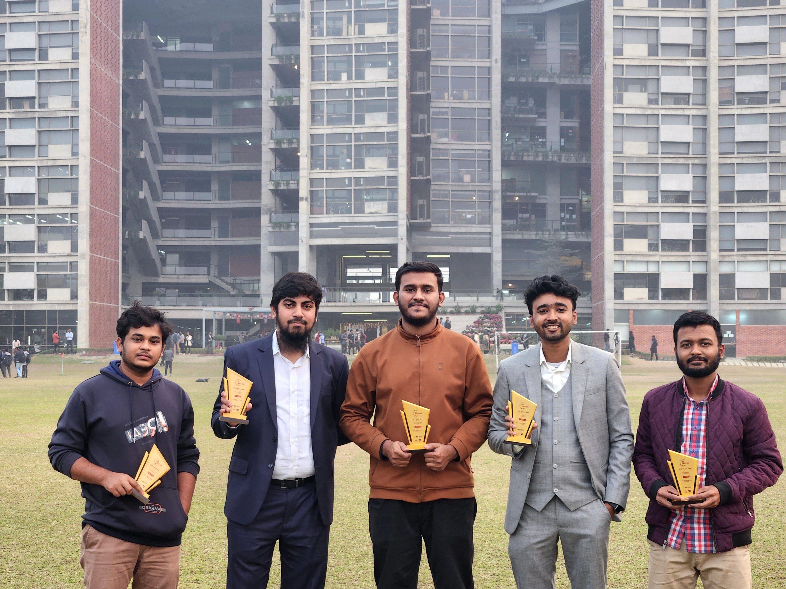
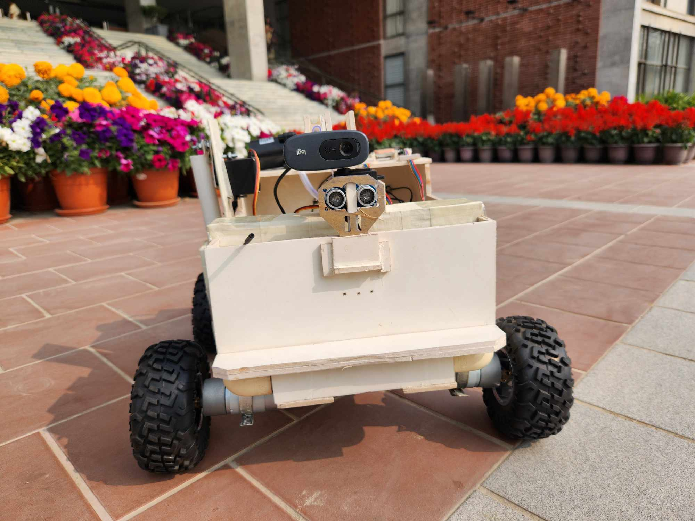
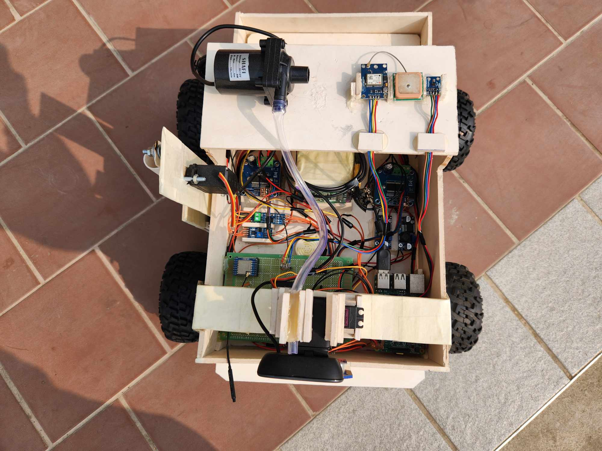
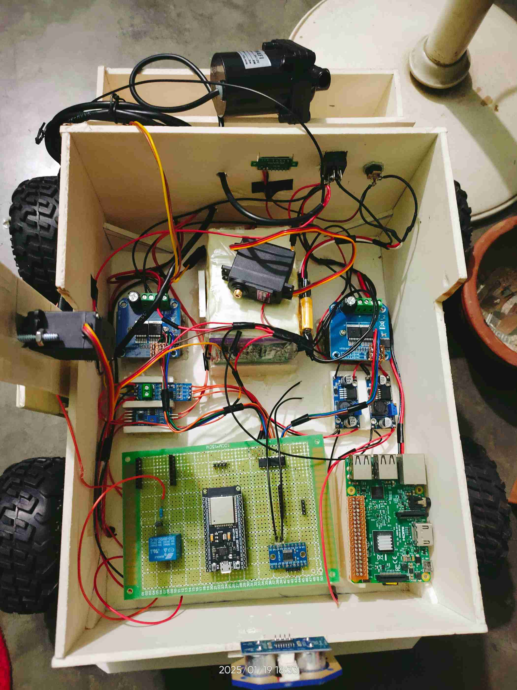
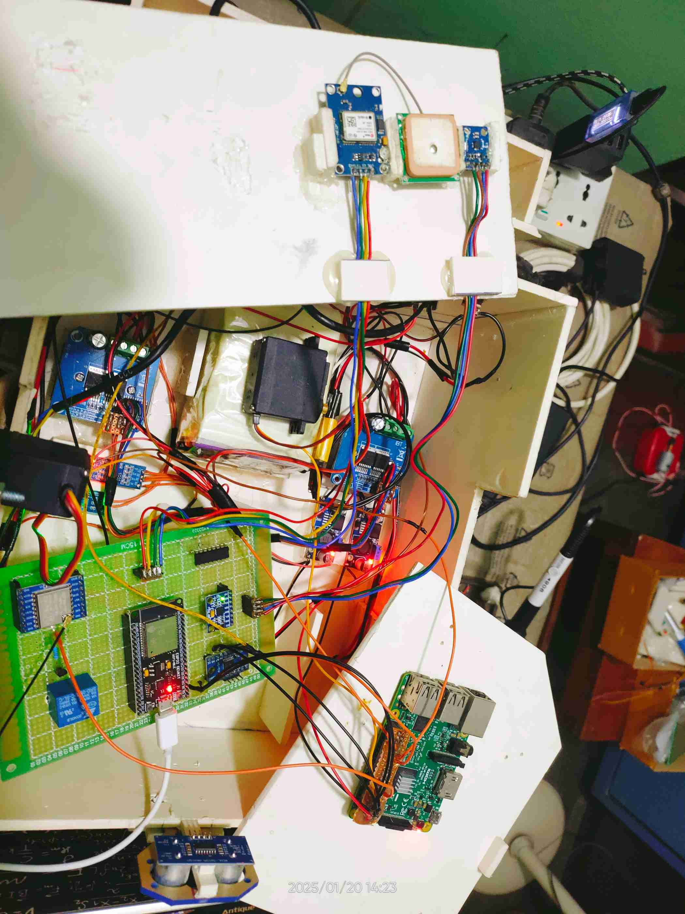
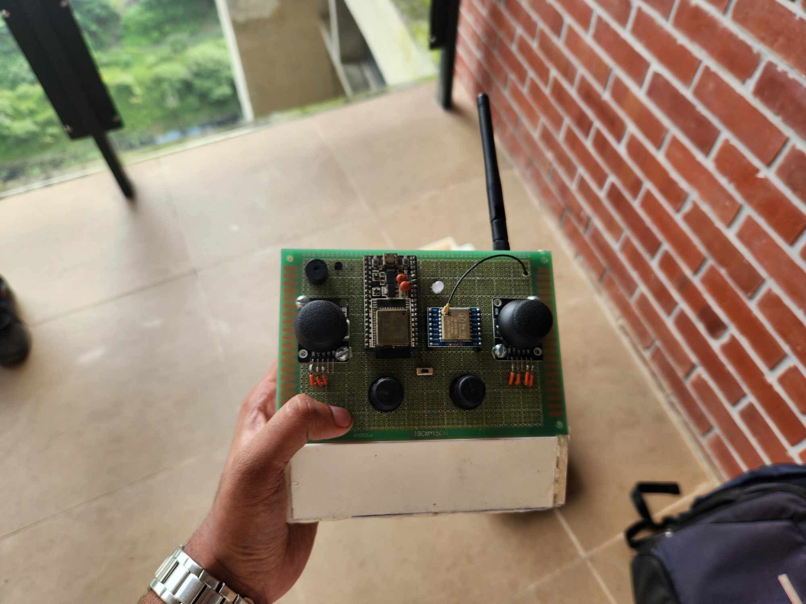
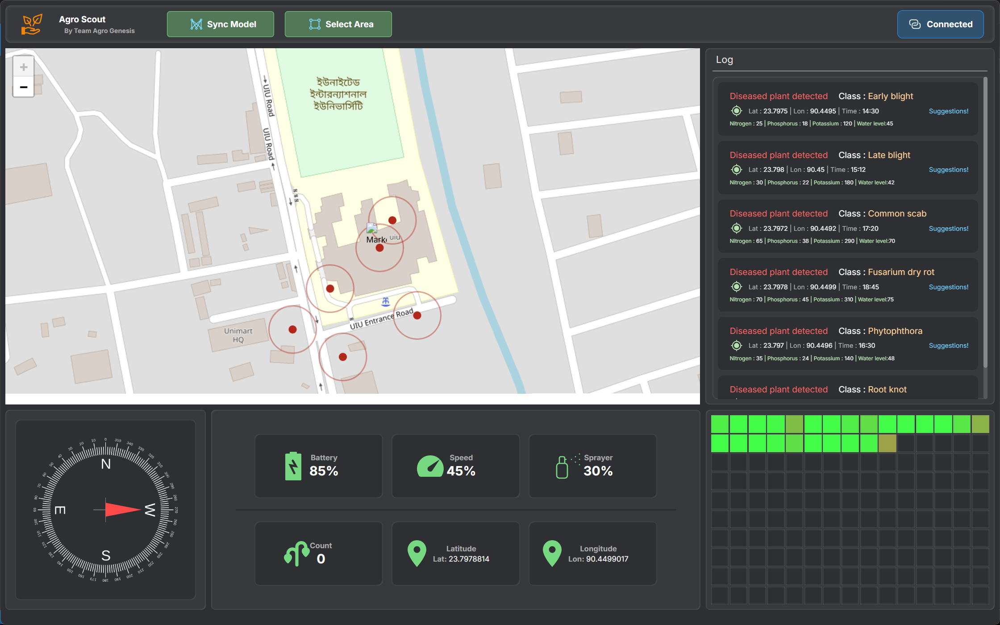
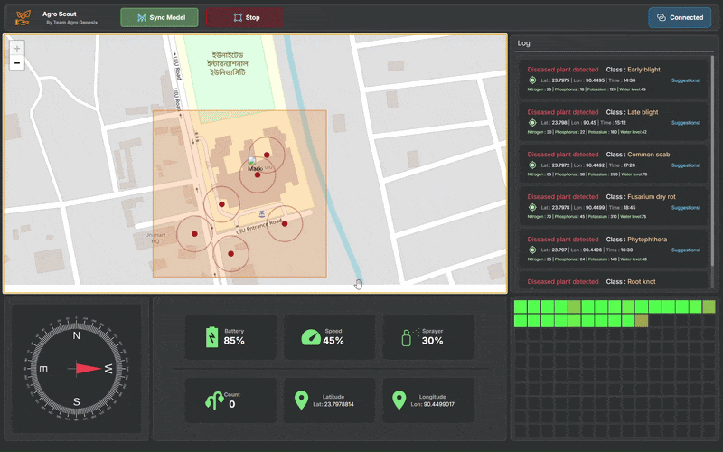

[](https://www.python.org/)
[](https://isocpp.org/)
[](https://docs.ultralytics.com/)
[](https://www.tensorflow.org/lite/)
[](https://doc.qt.io/qtforpython/)
[](https://leafletjs.com/)
[](https://www.openstreetmap.org/)
[](https://groq.com/)

# 🌱 Agro-Scout

### An Intelligent Agricultural Monitoring Rover

Agro-Scout is an agricultural scouting rover developed as a university project that combines **embedded systems, robotics, wireless communication, computer vision, environmental sensing, vision-guided navigation, and AI-assisted decision support**.

The system is designed for **structured agricultural fields with row-and-column crop arrangements**, where the rover can operate within a user-defined field region, follow crop rows using camera-based visual perception, collect environmental measurements, and provide real-time monitoring and AI-assisted recommendations through a desktop application.


# 🏆 Achievement

Agro-Scout was developed as part of the **Microprocessor & Microcontroller Laboratory at United International University** during the **243 Trimester**.

> 🏆 The project was presented at the university project **showcase** and received the **3rd Runner-Up** Prize.




# 📸 Project Showcase

## Rover Pictures 

<table  align="center">
  <tr>
    <td align="center">
      
      <br>
      <em>Rover — Front Perspective</em>
    </td>
    <td align="center">
      
      <br>
      <em>Rover — Side Perspective</em>
    </td>
  </tr>
  <tr>
    <td align="center">
      
      <br>
      <em>Rover — During Build</em>
    </td>
    <td align="center">
      
      <br>
      <em>Rover — During Build</em>
    </td>
  </tr>
</table>

---

## Remote Controller Showcase



*Custom ESP32-based remote controller with joystick and control interfaces.*

---


## 💻 Software Showcase

### Dashboard
The desktop dashboard provides a centralized view of **real-time rover telemetry, field data, and mission status**. It displays key information such as **battery level, rover and spray speed, GPS position, compass direction, NPK and soil moisture readings, field grid data, and operating boundaries**.

The software also includes a dedicated information/notification area for measurements received from the rover. This allows the operator to monitor incoming field information without continuously interpreting raw telemetry.



*Real-time rover monitoring and sensor dashboard.*


### 🗺️ Field Grid & AI Recommendations

The desktop software shows the field data in a **grid**, including NPK and soil moisture values. Each grid cell represents the data collected from a specific area of the field, making it easy to see how the conditions change across different areas.

When a grid cell is selected, the software shows its sensor data and sends the information to an **LLM API** to generate an agricultural recommendation for that area.


<p align="center">
  
  <br>
  <em>AI-powered recommendations based on selected field measurements.</em>
</p>


*AI recommendations based on the selected field data.*

> **Note:** The repository now includes **all three parts** of the system — the rover (Raspberry Pi + ESP32 slave), the ESP32 remote controller, and the desktop application.


# 🏗️ System Architecture


The system is divided into three physical/software nodes:

### 1. Rover

The rover contains the sensing, imaging, actuation, navigation, and onboard computing components.

### 2. Remote Controller

An ESP32-based controller provides manual control and serves as the wireless communication interface between the rover and the desktop application.

### 3. Desktop Application

The desktop software provides the operator interface for rover monitoring, mission configuration, field boundaries, sensor visualization, notifications, grid-based view and AI-assisted recommendations.

---

# 🤖 Vision-Guided Navigation

One of the key features of Agro-Scout is its **camera-based row-following navigation system**.

The rover is designed specifically for **structured agricultural fields where crops are arranged in relatively well-defined rows and columns**.

Rather than relying exclusively on GPS for local navigation, the rover uses its forward-facing camera to estimate the visual structure of the field.

## Visual Path Estimation

The forward camera continuously captures images of the area ahead of the rover.

The navigation pipeline analyzes the spatial distribution of vegetation pixels on the left and right portions of the image.

Conceptually:

```text
                 Forward Camera
                       │
                       ▼
                Image Acquisition
                       │
                       ▼
             Image Pre-processing
                       │
                       ▼
          Vegetation / Green Pixel Map
                       │
             ┌─────────┴─────────┐
             │                   │
             ▼                   ▼
       Left-side Region    Right-side Region
             │                   │
             └─────────┬─────────┘
                       ▼
              Drivable Corridor
                       │
                       ▼
                Steering Decision
                       │
                       ▼
                 Motor Control
```

The vegetation distribution on the two sides of the image is used to estimate the available corridor between crop rows.

The rover then adjusts its movement to remain aligned with the detected agricultural path.

---


## 🧭 Boundary-Constrained Autonomous Navigation

The rover operates within a **user-defined rectangular field region** selected through the desktop application. The selected coordinates define the geographic boundary for autonomous operation, while the forward-facing camera provides **local row-following guidance** based on the visual structure of the field.

The navigation system combines **GPS-based boundary constraints** with **camera-based local path detection**. During normal operation, the rover follows the detected corridor between crop rows and continuously monitors its position and the availability of the current path.

If the rover reaches the defined boundary or the current row becomes unavailable, it performs a **left/right visual search** to identify a valid adjacent row or path entry. Once a suitable path is detected, the rover redirects and resumes row-following within the defined operating region.

```text
GPS / Coordinate Boundary
          ↓
   Defined Operating Region
          ↓
 Camera-Based Row Detection
          ↓
   Valid Path Detected?
       ↙           ↘
     YES            NO
      ↓              ↓
Follow Row      Left / Right Search
      ↓              ↓
Boundary Check   Valid Row Found?
      ↓            ↙       ↘
   Continue      YES        NO
      │           ↓          ↓
      └────── Resume       Continue
             Navigation    Path Search
```


## 🧠 Onboard Image Processing

The Raspberry Pi 4 is used as the rover's onboard computing platform.

The vision pipeline is designed around lightweight image processing suitable for edge execution.

```text
Camera
  │
  ▼
Frame Capture
  │
  ▼
Image Pre-processing
  │
  ├──────────────────┐
  │                  │
  ▼                  ▼
Path Analysis     Plant/Disease
                  Classification
  │                  │
  └────────┬─────────┘
           ▼
      Rover Decision
```

Two vision-related functions are therefore integrated into the rover concept:

1. **Path perception** for row-following navigation
2. **Image classification** for plant/disease-related analysis

### Plant/Disease Detection Pipeline

The plant/disease analysis is performed **entirely onboard** the Raspberry Pi using two lightweight models exported to the **TensorFlow Lite** format and executed through the `tflite-runtime` interpreter:

1. **Leaf detection** — a lightweight YOLO model (`leaf_detect.tflite`) locates individual leaves in the captured frame and returns their bounding boxes (confidence above 0.7, followed by non-maximum suppression).
2. **Disease classification** — each detected leaf is cropped, resized, and passed to an EfficientNet-based classifier (`leaf_classify.tflite`). If any leaf's disease probability exceeds the threshold, the rover triggers the actuation sequence (buzzer, NPK measurement, dropping mechanism, data transmission).

```text
Frame
  │
  ▼
Leaf Bounding-Box Detection (YOLO → TFLite)
  │
  ▼
Crop each detected leaf
  │
  ▼
Per-leaf Disease Classification (EfficientNet → TFLite)
  │
  ▼
Any disease probability > 0.7 ?
  │
  ├── Yes ──→ Actuation (buzzer / drop / NPK / transmit)
  └── No  ──→ Continue navigation
```

Running both models through the TFLite interpreter keeps the onboard footprint minimal — only the small `tflite-runtime` package is required at runtime, with no full PyTorch or TensorFlow installation on the rover.


# 🚜 Rover Hardware 

## Drive & Power

| Component                      | Purpose                         |
| ------------------------------ | ------------------------------- |
| **12V 300 RPM DC Gear Motors** | Wheel drive                     |
| **BTS7960**                    | High-current motor driver       |
| **18650 Li-ion Cells — 3S4P**  | Main battery pack               |
| **BMS**                        | Battery protection and charging |
| **Buck Converter**             | Voltage regulation              |

---

## Sensing & Perception

| Component                   | Purpose                         |
| --------------------------- | ------------------------------- |
| **Raspberry Pi 4**          | Onboard computing               |
| **Logitech Webcam**         | Forward image capture           |
| **NPK Soil Sensor — RS485** | Soil nutrient measurement       |
| **Soil Moisture Sensor**    | Moisture measurement            |
| **NEO-8M GPS**              | Position tracking               |
| **GY-271 / HMC5883L**       | Heading/orientation measurement |

---

## Actuation

| Component           | Purpose                 |
| ------------------- | ----------------------- |
| **Servo Motor**     | Camera positioning      |
| **Servo Mechanism** | NPKW Sensor pushing     |
| **12V Mini Pump**   | Water/chemical spraying |
| **DC Gear Motors**  | Rover movement          |

---

## Wireless Communication

| Component       | Purpose                                 |
| --------------- | --------------------------------------- |
| **LoRa SX1278** | Long-range rover ↔ remote communication |

---

# 🎮 Remote Controller Hardware

The remote controller is built around an **ESP32**.

| Component          | Purpose                                |
| ------------------ | -------------------------------------- |
| **ESP32**          | Controller and communication processor |
| **2× Joysticks**   | Rover movement control                 |
| **LoRa SX1278**    | Rover communication                    |
| **Potentiometers** | Rover/spray speed adjustment           |
| **USB**            | Connection to desktop software         |


---

# 📡 Why LoRa?

The rover communicates with the remote controller using an **SX1278 LoRa module**.

This provides a **long-range wireless communication link with a theoretical data rate of up to 10 kbps**, making it suitable for transmitting control commands, telemetry, sensor measurements, and status information.


# 🛠️ Technology Stack

| Category | Technologies |
|---|---|
| **Embedded Systems** | Raspberry Pi 4, ESP32, Python, C/C++ |
| **Communication** | LoRa SX1278, RS485, Serial Communication |
| **Computer Vision** | OpenCV |
| **Desktop Application** | Python, PySide6, HTML, CSS, JavaScript |
| **AI** | Groq LLM API (Llama 3) |


# 📁 Repository Structure

```text
Agro-Scout/
│
├── firmware/                            # ESP32 sketches (Arduino IDE)
│   ├── remote_controller/
│   │   └── remote_controller.ino        # handheld controller (USB ⇄ LoRa)
│   └── rover_slave/
│       └── rover_slave.ino              # rover slave (I2C + LoRa + motors + sensors)
│
├── rover/                               # Raspberry Pi code
│   ├── rover.py                         # main rover program
│   ├── README.md                        # full model training & setup guide
│   ├── models/
│   │   ├── leaf_detect.tflite           # YOLO leaf detector (runtime)
│   │   └── leaf_classify.tflite         # disease classifier (runtime)
│   └── requirements.txt
│
├── Software/                            # Desktop application
│   ├── src/
│   │   ├── main.py
│   │   ├── utilities/
│   │   └── widget/
│   ├── res/
│   │   ├── templates/
│   │   ├── static/
│   │   └── icon/
│   └── requirements.txt
│
├── assets/
│   └── images/                          # screenshots used in this README
│
└── README.md
```


# 🚀 Getting Started

The system has three nodes that talk to each other over **LoRa** (rover ↔ controller) and **USB** (controller ↔ desktop).

## 1. Desktop Application (Windows / Linux)

```bash
cd Software
pip install -r requirements.txt
python src/main.py
```

- Plug the ESP32 controller into the PC over USB (it should expose a **CP2102** serial port — check Device Manager / `ls /dev/ttyUSB*`).
- The app auto-detects the controller (VID 4292 / PID 60000) and connects at 115200 baud.

#### Add your Groq API key

1. Create a free account at [console.groq.com](https://console.groq.com) and generate an API key.
2. Open `Software/src/main.py` and replace `YOUR_GROQ_API_KEY` with your key:

   ```python
   self.ai = Suggestion('YOUR_GROQ_API_KEY')
   ```

> AI suggestions are generated via the **Groq API** (Llama 3 model).

## 2. Rover — Raspberry Pi

1. Copy the whole `rover/` folder onto the Pi (including the two `.tflite` models in `rover/models/`).
2. Install the Python dependencies:

   ```bash
   cd rover
   pip install -r requirements.txt
   ```

3. Enable the interfaces (`sudo raspi-config` → Interface Options):
   - **I2C** → Enable *(ESP32 slave + magnetometer)*
   - **Serial** → Enable the serial port, **disable** the login console *(GPS on `/dev/serial0`)*
   - **Camera** → Enable
4. Connect the USB webcam, then run:

   ```bash
   sudo python3 rover.py
   ```

## 3. Firmware — the two ESP32s

Open the sketches in the **Arduino IDE**:

1. Add ESP32 board support: `File → Preferences → Additional boards manager URLs` → `https://dl.espressif.com/dl/package_esp32_index.json`, then install `esp32` from the Boards Manager.
2. Install the libraries from the Library Manager: **LoRa** (by Sandeep Mistry) and **ESP32Servo**.
3. Upload the correct sketch to each board:

| Sketch | Board | Location |
|---|---|---|
| `firmware/rover_slave/rover_slave.ino` | ESP32 | on the rover (I2C slave @ `0x20`) |
| `firmware/remote_controller/remote_controller.ino` | ESP32 | the handheld controller (USB to desktop) |

Both radios use **433 MHz** — set the SX1278 modules (rover + controller) to the same frequency and antenna length.

---

# 🤖 Onboard Models

The rover runs two lightweight **TensorFlow Lite** models directly on the Raspberry Pi — a YOLO model that finds leaves and an EfficientNet classifier that checks each leaf for disease. Everything runs onboard; no cloud or internet is needed.

> 📖 **Full model guide** — what data you need, how to train each model, how to convert and install them:

> 👉 **[`rover/README.md`](rover/README.md)**

---


## 🎓 Course & Team Details

> **Institution:** United International University (UIU)  
> **Course:** Microprocessor & Microcontroller Laboratory  
> **Trimester:** 243

| Team Member | Student ID |
| :--- | :--- |
| **Rifat Rahman** | `011202254` |
| **Teammate Name** | `011...` |
| **Teammate Name** | `011...` |
| **Teammate Name** | `011...` |
| **Teammate Name** | `011...` |
